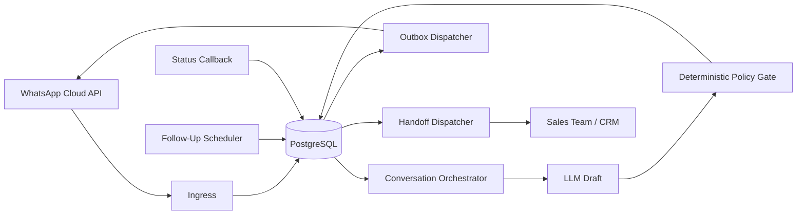
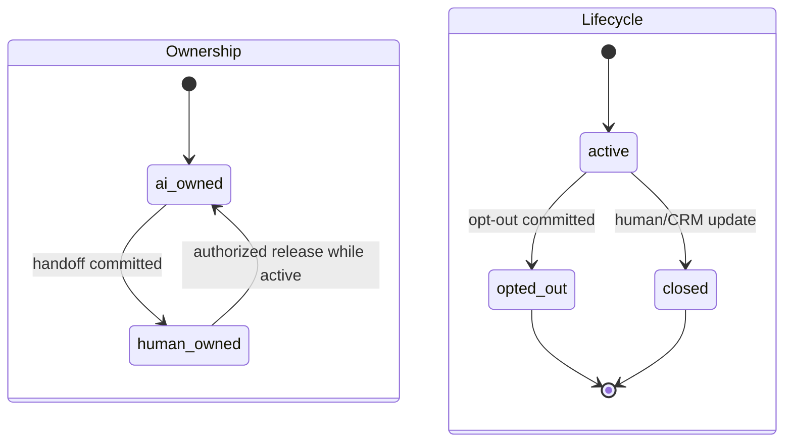
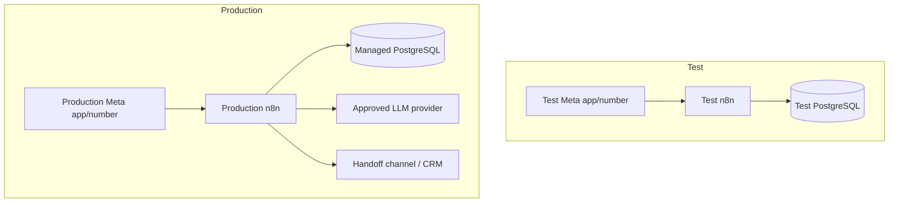

# Architecture Spine — N8N SalesFlow AI

## Design Paradigm

**Pipes-and-filters with a deterministic policy gate and durable outbox.** Each n8n workflow performs one stage and communicates through persisted records. PostgreSQL owns business state. External inputs and model output are untrusted until validated. Side effects originate only from persisted send intents.



Dependency direction: triggers and schedulers call domain filters; domain filters read/write PostgreSQL; only dispatchers call external side-effect APIs. The LLM cannot call WhatsApp, PostgreSQL mutation tools, or CRM tools.

## Invariants & Rules

### AD-1 — PostgreSQL is the business-state authority [ADOPTED]

- **Binds:** FR-1..FR-20
- **Prevents:** n8n executions, LLM memory, WhatsApp status, and CRM copies independently owning the same Conversation state.
- **Rule:** Contacts, Conversations, message ledger, ownership, Lead Facts, published policies, Follow-Ups, Handoffs, outbox, and Audit Events are committed in PostgreSQL; n8n execution data is diagnostic only.

### AD-2 — The LLM is a stateless, untrusted drafter

- **Binds:** FR-4..FR-10
- **Prevents:** prompt injection or hallucination directly mutating state, selecting unapproved terms, or sending a message.
- **Rule:** The LLM receives an allowlisted bounded context and returns a schema-validated draft; it has no direct send, database mutation, CRM, URL-fetch, or arbitrary tool authority.

### AD-3 — Ownership and lifecycle are orthogonal

- **Binds:** FR-10..FR-14
- **Prevents:** one unit representing `closed`/`opted_out` as ownership while another preserves AI/Human ownership, and bot/human replies racing.
- **Rule:** `automation_owner` is exactly `ai|human`; `lifecycle` is exactly `active|opted_out|closed`. Only `active+ai` is eligible for automation. Human takeover commits before notification. Release to AI requires `lifecycle=active`, an authorized actor, and an Audit Event.

### AD-4 — Commercial policy is deterministic and versioned

- **Binds:** FR-7..FR-9, FR-15, FR-18
- **Prevents:** different workflow units interpreting discounts, prices, terms, or prohibited claims differently.
- **Rule:** A turn snapshots the effective Sales Policy version at creation. Before dispatch, the authorization gate verifies that version is still active and not safety-revoked; if revoked, the intent is cancelled and the turn is recomputed or handed off. Values absent from the validated version cannot be sent.

### AD-5 — Inbound and outbound actions are idempotent

- **Binds:** FR-1, FR-2, FR-11, FR-13, FR-16, FR-17
- **Prevents:** webhook retry, workflow retry, or concurrent processing creating duplicate replies, Follow-Ups, or Handoffs.
- **Rule:** Provider inbound message ID is unique; each logical outbound action has a unique key `(conversation_id, source_event_id, action_type, generation)`. Generation is allocated once for a new logical action; workflow/provider retries reuse it, and only an explicit superseding action increments it.

### AD-6 — Conversation turns are serialized

- **Binds:** FR-2, FR-5, FR-11..FR-14
- **Prevents:** two inbound messages or scheduled jobs computing from the same stale Conversation state.
- **Rule:** State-changing work uses a PostgreSQL row lock, transaction-level advisory lock, or compare-and-set version inside the same database transaction as its state, outbox/Handoff, Follow-Up, and Audit Event mutations. Separate n8n nodes are not one transaction. Deadlock/serialization retries reuse the logical action key and obey a bounded retry/lock-timeout policy.

### AD-7 — Side effects use a transactional outbox

- **Binds:** FR-11, FR-16, FR-17, FR-19
- **Prevents:** state commits without a traceable send intent or sends occurring without committed state.
- **Rule:** The state transition, unique outbox/Handoff record, and Audit Event commit in one PostgreSQL transaction implemented as one parameterized statement/CTE, one Postgres transaction batch, or one narrowly scoped stored function. Dispatchers perform external calls afterward. Provider callbacks append immutable status events; derived status follows an allowed monotonic transition order and cannot be downgraded by an older write.

### AD-8 — Follow-Ups are due jobs, not workflow memory

- **Binds:** FR-13, FR-14
- **Prevents:** stale Wait executions sending after reply, opt-out, Handoff, campaign stop, or retry.
- **Rule:** A published Schedule Trigger with explicit UTC workflow/instance timezone queries bounded batches where `due_at <= now()`, including downtime catch-up. Every claim revalidates Conversation version and all eligibility conditions immediately before creating a send intent; backlog size/age is alerted.

### AD-9 — WhatsApp window and template eligibility are hard gates

- **Binds:** FR-3, FR-14
- **Prevents:** generated free-form business-initiated messages outside the customer-service window.
- **Rule:** The policy gate derives window state from the last eligible customer message; outside the window only an approved active template ID may proceed.

### AD-10 — Decisions snapshot provenance

- **Binds:** FR-4..FR-9, FR-15, FR-18
- **Prevents:** mutable current configuration making historical messages irreproducible.
- **Rule:** Each turn records source inbound ID and Product Knowledge, Sales Policy, prompt, model, template, and immutable `workflow_release_id` (Git commit plus canonical exported-workflow hash) plus validator outcome and evidence references. Business provenance remains after n8n execution data is pruned.

### AD-11 — Contact data is minimized, scoped, and deletable

- **Binds:** FR-5, FR-18, FR-20
- **Prevents:** cross-Contact leakage, phone-number reassignment exposing prior context, unnecessary PII reaching the model, or different workflows declaring deletion complete at different boundaries.
- **Rule:** Internal Contact/Conversation IDs scope every query; phone is a channel identifier; LLM payloads exclude direct identifiers and secrets unless an approved field map requires them. One deletion request record tracks every in-scope live store, provider request, execution-data purge, and backup-expiry obligation; completion means all immediate targets are cleared and deferred backup expiry is recorded.

### AD-12 — Pilot topology stays single until evidence forces scale

- **Binds:** NFR Performance, Reliability, Availability
- **Prevents:** two teams independently introducing Redis/workers or promising unsupported HA.
- **Rule:** Pilot deployment is one pinned n8n runtime plus managed PostgreSQL; queue mode, Redis, workers, webhook processors, and multi-main require measured saturation/backlog or an approved SLO and load test.

### AD-13 — Test and production channel environments are separate

- **Binds:** FR-1..FR-3, FR-15, FR-19
- **Prevents:** test credentials, subscriptions, templates, traffic, or enforcement state affecting production.
- **Rule:** Test and production use separate Meta apps/numbers and credentials; production policy cannot be published from test. The supported Graph API version, retirement date, permissions, webhook subscription, and template inventory are captured by credentialed smoke tests before build.

### AD-14 — One authorization gate precedes every customer send

- **Binds:** FR-3, FR-7..FR-9, FR-12..FR-17, FR-19
- **Prevents:** reactive, scheduled, retry, or fallback dispatchers applying different suppression rules or sending an intent that became invalid after creation.
- **Rule:** Immediately before every external customer send, including retries, one deterministic gate checks in order: global stop; Contact/Conversation disable; lifecycle; active consent evidence/category; opt-out/suppression; automation ownership; expected Conversation version; Sales Policy validity/revocation; window plus active template category/language; quiet hours/frequency/campaign eligibility. The only ownership exception is one fixed, approved, language-matched, non-commercial `handoff_acknowledgement` intent created atomically with the matching transition to Human-Owned and selected from the configured after-hours behavior; it cannot be recreated under a new logical key. Opt-out atomically invalidates every pending intent, including that acknowledgement. Any failed check suppresses/cancels the intent and records the reason before any provider call.

### AD-15 — Operations has one deployment and recovery authority

- **Binds:** FR-15, FR-18..FR-20, G7
- **Prevents:** incompatible workflow/schema rollout order, unowned secrets/backups/alerts, and unrecoverable partial deployment.
- **Rule:** The Operations Owner controls environment secrets, schema migration then compatible workflow activation, rollback, backup/restore drills, kill switch, monitoring, and incident recovery. A release manifest pins schema, workflows, policies, prompts, model, and external API versions; no workflow requiring a newer schema activates first.

### AD-16 — Model failure always transfers authority to a human

- **Binds:** FR-4, FR-6, FR-9..FR-12, FR-19
- **Prevents:** one orchestrator sending a generated/canned reply while another silently fails or keeps AI ownership after invalid, low-confidence, conflicting-source, timeout, or provider-error output.
- **Rule:** Every model failure category atomically creates/reuses a Handoff and sets `automation_owner=human`. A customer acknowledgement may send only when an Approved Fallback for that category exists and passes AD-14; it never restores AI ownership.

### AD-17 — The n8n runtime enforces the tool boundary

- **Binds:** FR-1, FR-6..FR-9, FR-19, FR-20, G3, G7
- **Prevents:** imported workflows, editors, Code/HTTP/command/file nodes, SSRF, or over-broad credentials bypassing AD-2.
- **Rule:** Production has an allowlisted node inventory; unneeded command/file/Code/HTTP and all community/custom nodes are excluded, SSRF protection and network egress allowlists are active, task execution is isolated or excluded, credentials are least-privilege per workflow, production editing is restricted, and `n8n audit` has no unapproved finding before release.

### AD-18 — Runtime and external API versions are immutable release inputs

- **Binds:** all workflows, G3, G7
- **Prevents:** mutable tags, silent Graph API retirement, or test/production version drift changing reviewed behavior.
- **Rule:** Each release manifest pins the tested n8n package and official container digest, dependency inventory, PostgreSQL deployment version, supported WhatsApp Graph API version/retirement date, and workflow release ID. Test and production use the reviewed artifacts; patch/upgrade and rollback evidence is required before promotion.

### AD-19 — PostgreSQL owns shared contracts and atomic commands

- **Binds:** FR-1..FR-20, all workflow units
- **Prevents:** workflows inventing incompatible table payloads, statuses, or direct multi-step mutations while each still claims PostgreSQL authority.
- **Rule:** One migration stream owns the shared schema. Cross-workflow aggregates are Contact, Conversation, Inbound Message, Outbound Intent, Provider Status Event, Lead Fact, Sales Policy, Product Knowledge, Follow-Up, Handoff, Deletion Request, and Audit Event. Each has one canonical ID and state vocabulary. State transitions use versioned parameterized stored commands/functions or single transaction batches; workflows do not invent aggregate-local JSON contracts.

### AD-20 — Database ingestion order is canonical

- **Binds:** FR-1, FR-2, FR-5, FR-6, FR-16
- **Prevents:** provider clock skew or out-of-order delivery producing different conversation histories in different workflows.
- **Rule:** PostgreSQL assigns a monotonic `ingested_seq` per Conversation at durable intake; provider timestamp is evidence only. Turns process by `ingested_seq`. A newer committed inbound event invalidates any older unsent draft/intent through the Conversation version guard; no speculative debounce/coalescing window is used in MVP.

### AD-21 — Dispatch uses a short version-bound lease

- **Binds:** FR-3, FR-12..FR-17, FR-19
- **Prevents:** two dispatchers sending one intent or holding database locks across a network call while suppression races remain undefined.
- **Rule:** One transaction runs AD-14, claims a non-expired dispatch lease tied to the current Conversation version, and sets `dispatching`; no database lock is held during the provider call. Immediately before the call, the dispatcher verifies the lease and suppression/version state. The provider-call start is the unavoidable external linearization boundary; a later opt-out cannot recall an in-flight request and is recorded for reconciliation.

### AD-22 — Product Knowledge supports safety revocation

- **Binds:** FR-4, FR-6, FR-9, FR-18
- **Prevents:** a previously approved but withdrawn claim being sent because one unit honors a snapshot while another honors revocation.
- **Rule:** Ordinary replacement does not invalidate an in-flight turn. `safety_revoked_at` does: AD-14 rejects any intent whose Product Knowledge version is safety-revoked, cancels it, and routes the turn through AD-16 for Handoff/Approved Fallback.

### AD-23 — Retry exhaustion is centralized and finite

- **Binds:** FR-11, FR-13, FR-16, FR-17, FR-19
- **Prevents:** workflows retrying indefinitely or inventing incompatible terminal states and replay behavior.
- **Rule:** One versioned Retry Policy supplies action-specific attempt and age budgets plus exponential backoff/jitter. No action retries indefinitely. Exhaustion sets `reconciliation_required`, alerts Operations, and preserves the original logical action key; only an audited operator replay may reuse that key.

### AD-24 — Agent clients are interchangeable build operators

- **Binds:** repository, workflow exports, database migrations, tests, release evidence
- **Prevents:** Codex, Antigravity, or OpenCode chat/config state becoming an undocumented build dependency or leaking production secrets through tools.
- **Rule:** Skills, MCPs, and CLIs may author or operate test-environment changes, but every durable change lands as canonical repository artifacts and passes the same validation/import/export checks. Production credentials remain in approved secret stores/n8n credentials; prompts, logged tool arguments, exports, fixtures, and source control contain no production secret or customer data. Each client uses its own verified configuration surface.

## Consistency Conventions

| Concern | Convention |
| --- | --- |
| IDs | Internal UUIDs; provider message IDs stored separately with unique constraints. |
| Time | UTC `timestamptz` in storage; approved business timezone applied only at quiet-hour/template decisions. |
| State | Lowercase enum values; every transition includes expected prior state/version and actor. |
| Events | Past-tense names such as `inbound_message_recorded`, `handoff_created`, `outbound_delivered`. |
| Errors | Typed category + retryable flag + correlation ID; customer-safe text separated from operator detail. |
| Logging | Structured and PII-minimized; correlation IDs join workflow execution to Audit Event and outbox record. |
| Configuration | Draft → validated → approved → published; immutable versions and explicit rollback. |
| SQL | Parameterized queries only; database constraints enforce uniqueness and allowed state. |

## Stack

| Name | Version |
| --- | --- |
| n8n | 2.30.4 |
| PostgreSQL | 17.10 |

The n8n version is the current package candidate verified on 2026-07-14, not permission to deploy `latest`. Exact container digest and supported WhatsApp Graph API version are build blockers under AD-18. Model/provider is deferred to the PRD evaluation gate.

## Structural Seed

```text
workflows/
  01-whatsapp-ingress.json
  02-conversation-orchestrator.json
  03-outbox-dispatcher.json
  04-whatsapp-status.json
  05-follow-up-scheduler.json
  06-handoff-dispatcher.json
  07-error-and-operations.json
database/
  001-initial.sql
tests/
  pilot-scenarios.json
```





## Capability → Architecture Map

| Capability / Area | Lives in | Governed by |
| --- | --- | --- |
| Trusted intake and dedupe (FR-1..FR-3) | 01 ingress + message ledger | AD-1, AD-5, AD-6, AD-13, AD-14, AD-17, AD-18 |
| Grounded drafting (FR-4..FR-6) | 02 orchestrator + knowledge/policy tables | AD-2, AD-10, AD-11 |
| Commercial/safety gate (FR-7..FR-9) | 02 deterministic validator | AD-2, AD-4, AD-10, AD-14, AD-16 |
| Handoff/ownership (FR-10..FR-12) | Conversation transaction + 06 dispatcher | AD-3, AD-5, AD-7, AD-14, AD-16, AD-19, AD-23 |
| Follow-Up (FR-13..FR-14) | Follow-Up table + 05 scheduler | AD-5, AD-6, AD-8, AD-9, AD-14, AD-19..AD-23 |
| Configuration/audit/operations (FR-15..FR-20) | PostgreSQL + 03/04/07 workflows | AD-1, AD-7, AD-10..AD-24 |

## Deferred

- LLM provider/model/prompt version — choose after the approved scenario benchmark; pin one configuration for pilot.
- CRM/Handoff adapter — choose after the executive names the system of record and acknowledgement SLA.
- Handoff acknowledgement state machine — affected dispatcher/operations stories remain blocked until the adapter, assignment owner, acknowledgement signal/SLA, timeout, and permanent-failure escalation are selected.
- Exact schema columns and indexes — story-level work constrained by AD-1, AD-3..AD-7, and AD-10..AD-16.
- Managed PostgreSQL provider — verify major-17 compatibility, current patched minor, TLS, pooling/connection limits, backup/PITR, restore, maintenance, metrics, and region before build.
- Redis queue mode, workers, webhook processors, load balancer, and multi-main — add only after measured load or approved availability SLO triggers AD-12's upgrade path; multi-main also requires eligible n8n licensing and budget.
- WhatsApp Graph API version and Meta assets — pin only after credentialed test/prod smoke tests prove webhook subscription, templates, permissions, duplicates/out-of-order behavior, and environment isolation.
- Vector retrieval — add only when Product Knowledge no longer fits bounded controlled context and evaluation proves need.
- Attachments/voice — separate threat model and media lifecycle required.
- Multi-tenant or multi-number operation — separate ownership, policy, credential, and isolation design required.
- Custom administration UI — add only if existing controlled tools cannot support policy publication safely.
