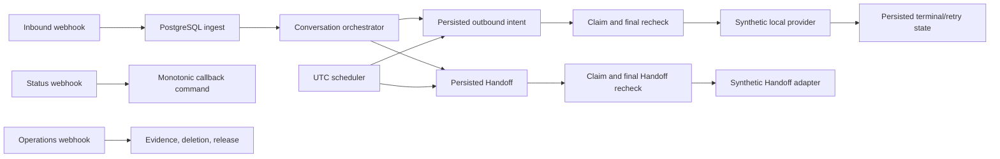

# N8N SalesFlow AI — Observed Architecture

**Date:** 2026-07-15
**Status:** Synthetic-local baseline implemented and verified

## Executive summary

The implementation follows the planned pipes-and-filters design: n8n supplies triggers and routing, while account-scoped PostgreSQL functions own every meaningful state transition. The source workflows contain no Code, command, community, or arbitrary HTTP nodes. Synthetic `Set` nodes stand in for the customer-facing and Handoff providers.

## Runtime boundaries

| Boundary | Responsibility |
| --- | --- |
| n8n | Receive authenticated calls, invoke SQL commands, branch on typed results, and chain workflows. |
| PostgreSQL | Validate account/role, serialize state, enforce policy, persist evidence, lease/claim work, and decide terminal outcomes. |
| JSON configuration | Provide immutable synthetic-local policy, knowledge, retry, consent/template, Handoff, retention, and release inputs. |
| Synthetic adapters | Return deterministic local outcomes only; they do not represent Meta, an LLM, or a CRM. |
| Test harness | Provision disposable credentials, publish artifacts, exercise live n8n paths, verify identity/security, and clean up. |

## Workflow topology

1. `01-whatsapp-ingress` calls `salesflow.ingest` and starts the orchestrator only for a new accepted event.
2. `02-conversation-orchestrator` calls `salesflow.complete_turn`, then routes created work to the outbox or Handoff dispatcher.
3. `03-outbox-dispatcher` claims, authorizes, rechecks, runs the synthetic provider, and finishes the intent.
4. `04-whatsapp-status` binds callbacks to an existing provider ID and preserves monotonic status.
5. `05-follow-up-scheduler` runs in UTC, discovers all-account due/retry work, and invokes the proper dispatcher.
6. `06-handoff-dispatcher` claims, rechecks, runs the synthetic Handoff adapter, and finishes the Handoff.
7. `07-error-and-operations` exposes account-bound evidence, deletion, and release commands.

## Data architecture

The schema contains 19 tables grouped around account/configuration, Contact/Conversation state, work and provider evidence, and operations/release records. Composite `(account_ref, id)` ownership keys prevent cross-account joins. Unique provider IDs, sequence numbers, logical action keys, callback event IDs, and release pointers make replays deterministic.

See [data-models.md](./data-models.md).

## Security and reliability controls

- Runtime tokens are stored as hashes and mapped to scoped roles.
- The workflow database role receives function execution, not direct table mutation.
- Missing controls/configuration fail closed.
- Claims and leases expire; retry budgets and backoff are configuration-driven.
- Inbound replay conflicts, callback conflicts, and stale Conversation versions are rejected.
- Audit/provider evidence is append-only except narrowly scoped deletion minimization.
- n8n execution payload persistence is disabled; generated credentials are ignored and deleted in `finally`.

## Testing strategy

`tests/run.ps1` combines static manifest checks, migration idempotence, SQL assertions, concurrent workers, n8n import/activation/publication, connected endpoint calls, export identity checks, and cleanup verification. The current evidence records `PASS FULL PASS` for S01-S26 and race checks.

## Deployment architecture

The only implemented deployment is a local Docker Compose environment bound to `127.0.0.1:5678`. The planned managed PostgreSQL, Meta, LLM, and CRM/Handoff services are not connected. See [deployment-guide.md](./deployment-guide.md).

## Canonical design authority

This file documents observed implementation. Requirements and design invariants remain in the [PRD](../_bmad-output/planning-artifacts/prds/prd-N8N-SalesFlow-AI-2026-07-14/prd.md) and [architecture spine](../_bmad-output/planning-artifacts/architecture/architecture-N8N-SalesFlow-AI-2026-07-14/ARCHITECTURE-SPINE.md).
