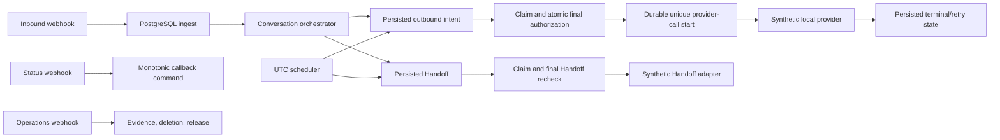

# N8N SalesFlow AI — Observed Architecture

**Date:** 2026-09-05
**Status:** Synthetic-local implementation and review fixes verified by the September 5 canonical Docker harness

## Executive summary

The implementation follows the planned pipes-and-filters design: n8n supplies triggers and routing, while account-scoped PostgreSQL functions own every meaningful state transition. Workflow 01 contains two narrowly allowlisted Code nodes: one captures the raw test request bytes and one verifies the test WhatsApp HMAC and constructs the minimized envelope. The source workflows contain no command, community, or arbitrary HTTP nodes. Synthetic `Set` nodes stand in for the customer-facing and Handoff providers.

## Runtime boundaries

| Boundary | Responsibility |
| --- | --- |
| n8n | Receive authenticated calls, invoke SQL commands, branch on typed results, and chain workflows. |
| PostgreSQL | Validate account/role, serialize state, enforce policy, persist evidence, lease/claim work, and decide terminal outcomes. |
| JSON configuration | Provide immutable synthetic-local policy, knowledge, retry, consent/template, Handoff, retention, and release inputs. |
| Synthetic adapters | Return deterministic local outcomes only; they do not represent Meta, an LLM, or a CRM. |
| Test harness | Provision disposable credentials, publish artifacts, exercise live n8n paths, verify identity/security, and clean up. |

## Workflow topology

1. `01-whatsapp-ingress` calls `salesflow.ingest` and starts the orchestrator only after a committed `accepted=true, created=true` result. Its signed test WhatsApp route remains terminal staging and never starts orchestration.
2. `02-conversation-orchestrator` calls `salesflow.complete_turn`, which claims committed Turns in database sequence. Handoff-only work follows its existing path; before AI drafting, PostgreSQL requires latest granted consent, locks the active Release Set and both active business documents together, rejects a pair that conflicts with that Release Set, and records a bounded same-Conversation inbound context snapshot with the resulting intent.
3. `03-outbox-dispatcher` claims the intent, then atomically reruns current authorization and creates its one durable provider-call record. Only a newly created call-start reaches the synthetic provider; completion records accepted/failed/ambiguous evidence.
4. `04-whatsapp-status` binds callbacks to an existing provider ID, preserves immutable event evidence and monotonic derived status, and can resolve an uncertain started call without resending it.
5. `05-follow-up-scheduler` runs in UTC. A successfully sent reply schedules one immutable evidence-bound job for exactly 12 hours later. At due time and provider-call start PostgreSQL rechecks the account, active WhatsApp/Meta identifier, stop control, Conversation version/lifecycle/owner/campaign, latest consent, active Release Set/business versions, retry budget, approved template window, quiet hours, and rolling frequency cap. It cancels or denies ineligible work with an exact reason; otherwise it creates one Follow-Up intent and invokes workflow 03. Durable high-water cursors continue due, reconciliation, and final work traversal across bounded runs, wrap to older keys, and checkpoint best-effort when another scheduler owns a cursor row. Workflow 05 applies its safety timeout transaction-locally.
6. `06-handoff-dispatcher` claims, rechecks, runs the synthetic Handoff adapter, and finishes the Handoff.
7. `07-error-and-operations` exposes account-bound emergency-stop, activity, failure/retry, evidence, deletion, and release commands. PostgreSQL accepts stop changes on the same advisory lock used at provider-call start, making the committed stop the exact boundary for new automated calls.

## Data architecture

The schema contains 32 tables grouped around account/configuration, stable Customer/Contact identity, Conversation state, work and provider evidence, and operations/release records. `operational_failures` is an append-only, retention-governed projection of retry, failure, ambiguity/reconciliation, and Handoff notification outcomes with stable keyset IDs. Content-free activity and failure backfill markers ensure migration replay does not recreate legacy projections removed by approved retention; first-time backfill also excludes known evidence already outside the active audit-retention window. Phone and provider references live in UUID-backed `contact_identifiers`, where explicit replacement retires the old reference without changing the Contact or Conversation UUID. Each inbound row retains immutable original text and a separately derived NFC/newline/outer-trim processing form. Composite `(account_ref, id)` ownership keys prevent cross-account joins. PostgreSQL-owned Conversation sequences, exact original-evidence retry checks, one provider-call row per logical intent, unique provider IDs and opaque callback aliases, callback event IDs, immutable Follow-Up transitions, parent-independent busy/reconciliation evidence, durable scheduler cursors, and release pointers make replays deterministic even when provider timestamps arrive out of order.

For an eligible reply, relevance is deterministic recency rather than semantic retrieval: the current inbound plus the newest predecessors that fit a maximum of ten messages and 32 KiB of processing text. A non-fitting predecessor is skipped so an older smaller message can still be selected; an oversized current message fails closed with `context_too_large`. Reads are constrained to the locked account/Conversation and `seq <=` the current source, then references are persisted in ascending sequence. Product Knowledge and Sales Policy remain independently publishable, but context assembly takes the same activation locks in deterministic order before its joined read, so it either uses the post-commit live pair or returns bounded `busy`. Processing text exists only in the ephemeral drafting payload; persisted provenance records consent, business versions, and references. Privacy deletion may later minimize referenced customer content and intent provenance. Grounding requires every claim the synthetic drafter makes to be allowed by the active model and Sales Policy and supplied by at least one active Product Knowledge source; reply provenance records the matching source IDs and the first allowed offer from the active configuration, never fixture identifiers.

See [data-models.md](./data-models.md).

## Security and reliability controls

- Runtime tokens are stored as hashes and mapped to scoped roles.
- The workflow database role receives function execution, not direct table mutation.
- Missing controls/configuration fail closed.
- Missing/revoked consent or either active business document suppresses AI drafting with a typed minimized result; consent writes serialize with context creation under a bounded lock, consent timestamps are strictly monotonic per Contact, and provider-call start locks the Contact/Conversation plus the same consent, configuration, and stop-control authorities before its final authorization read.
- Claims and leases expire; retry budgets and backoff are configuration-driven only before a provider call starts. A live post-start lease returns `already_started`; only an expired or explicitly ambiguous call becomes reconciliation-required and is never automatically resent.
- Follow-Up writers and workers share one Conversation-first advisory-lock protocol. Dispatch, callback, Conversation, consent, inbound, deletion, account, and stop-control paths have finite overall lock deadlines; each successive acquisition uses only the remaining time, and commands return typed `busy` without partial changes where a retrying caller is available. Consent, inbound, and deletion use a five-second bound to preserve established serialized races, while account/control writers retain the one-second fast-busy boundary. Meta envelope intake has the same bounded busy result. Busy scheduler probes use transaction-scoped locks inside rollbackable subtransactions, and reconciliation traverses beyond busy candidates with candidate-local rollback, so one contention event cannot erase earlier scheduler progress. Parent state changes are persisted before child/provider exposure; pending retry children are projected only while the parent is `intent_created`, pre-call exhaustion suppresses without inventing reconciliation, sent parents advance monotonically to delivered or failed, and terminal parents are append-only.
- Inbound replay conflicts are durably flagged without sender or message text; callback conflicts and stale Conversation versions are rejected.
- Audit/provider evidence is append-only except narrowly scoped deletion minimization.
- n8n execution payload persistence is disabled; generated credentials are ignored and deleted in `finally`.

## Testing strategy

`tests/run.ps1` combines static manifest checks, migration idempotence, SQL assertions, concurrent workers, commit-visibility checks, n8n import/activation/publication, connected endpoint calls, export identity checks, and cleanup verification. SP2-T2 proof covers strict typed input, Unicode and formatting preservation, the processing-form invariant, normal intake, concurrent duplicate retry, sender/body conflict, decreasing and equal provider timestamps, database-sequence consumption, deletion minimization, and the absence of retry/conflict downstream work. SP2-T3/SP3-T1 proof covers consent and business-context isolation, bounded context, publication races, and immutable versioned provenance. SP3-T2 proof covers the final authorization/call-start boundary, pre-start retry versus post-start reconciliation, 20 concurrent sends and deliveries, and a concurrent retry of those same 20 work IDs with zero additional calls or evidence. SP3-T3 proof covers automatic +12-hour persistence from a durable database send transition, exact approved template metadata, replay deduplication, reply/stale-version cancellation, exact due-time reauthorization, coherent parent/child/call states, retry-parent projection, disabled-account restoration, deletion-safe alias replay, exact non-negative backlog/age/retry/exhaustion metrics, voluntary scheduler exit under a larger safety timeout, an overall 50-work cap, and scanning past 200 locked jobs to process the 201st.

## Deployment architecture

The only implemented deployment is a checkout-scoped local Docker Compose environment with n8n bound to a dynamically assigned port on `127.0.0.1`. The harness resolves that port with `docker compose port`; it is not a stable production endpoint. The planned managed PostgreSQL, Meta, LLM, and CRM/Handoff services are not connected. See [deployment-guide.md](./deployment-guide.md).

## Canonical design authority

This file documents observed implementation. Requirements and design invariants remain in the [PRD](../_bmad-output/planning-artifacts/prds/prd-N8N-SalesFlow-AI-2026-07-14/prd.md) and [architecture spine](../_bmad-output/planning-artifacts/architecture/architecture-N8N-SalesFlow-AI-2026-07-14/ARCHITECTURE-SPINE.md).
